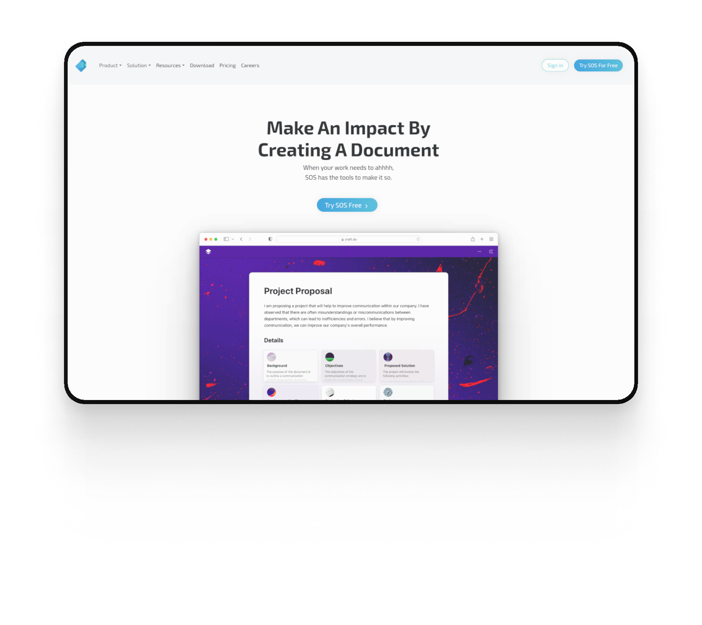
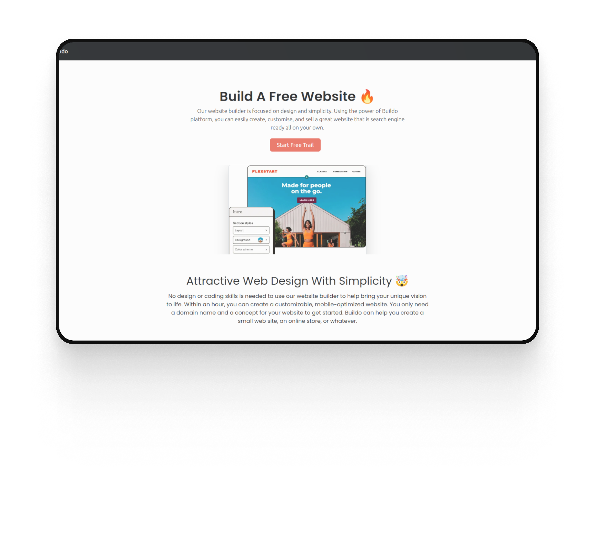
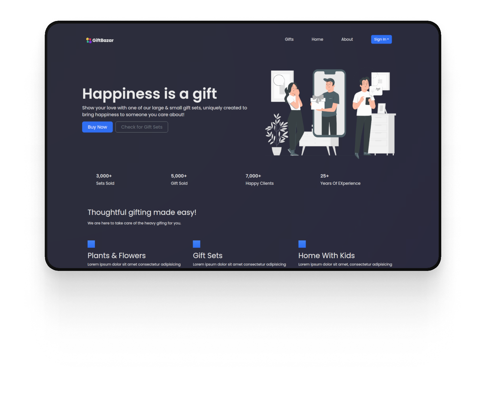
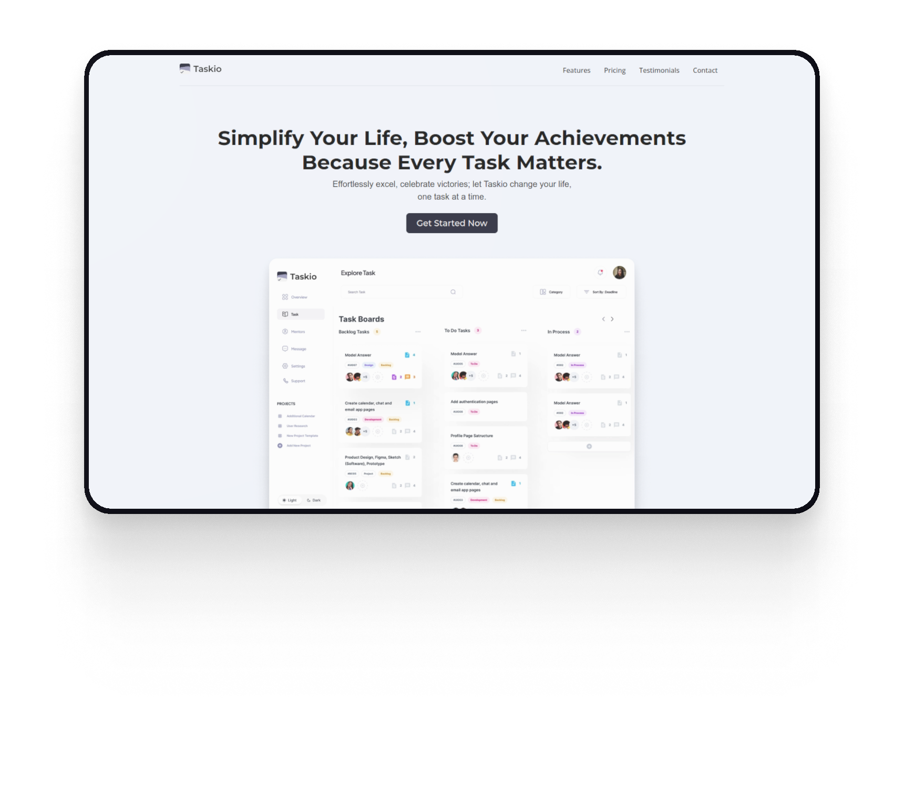
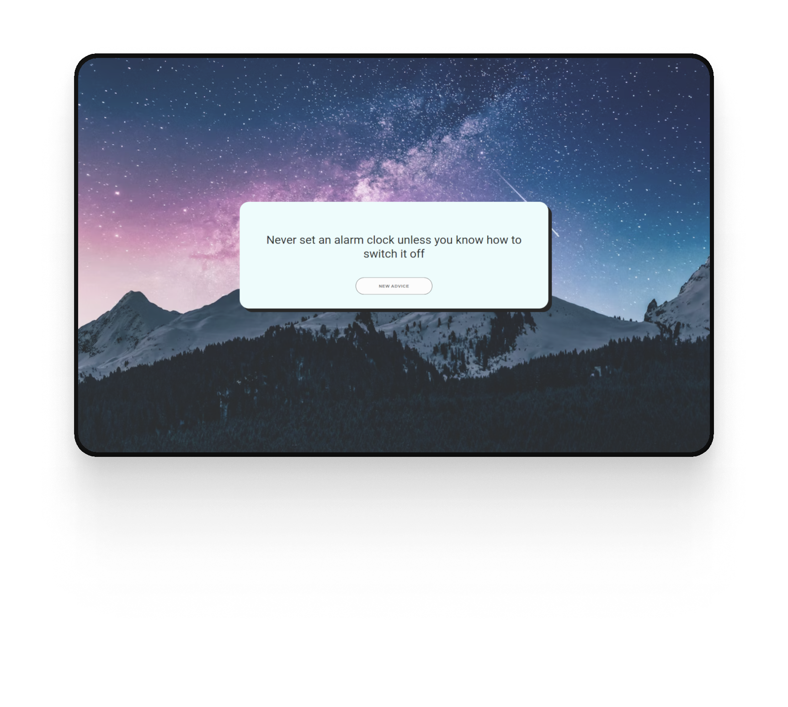

# P. Rehan's Portfolio

Welcome to my portfolio! This is the place where you can learn more about me, explore the projects I've worked on, and get in touch. Feel free to browse around and don't hesitate to reach out if you're interested in collaborating or just want to say hello.

## Table of Contents

- [About Me](#about-me)
- [Projects](#projects)
- [Skills](#skills)
- [Contact](#contact)

## About Me

I am a passionate Web Developer with a strong interest in ReactJS and Web Design. I'm dedicated to creating meaningful and user-centric digital experiences. Through a combination of creativity and technical skills, I aim to bring ideas to life and solve real-world problems.

## Projects

### [SOS Docs](#)

- **Description**: SOS Doc - Streamline Documentation Effortlessly. Create project papers in a snap with SOS Doc's smart document generation. Focus on what matters most – let your projects shine with hassle-free paperwork.
- **Demo**: https://sos-docs.netlify.app/
- **GitHub Repository**: https://github.com/rehanpinjari/sos-doc

### [Buildo](#)

- **Description**: Buildo: Your Path to Digital Excellence. Create breathtaking websites effortlessly. Unleash creativity, design flawlessly responsive pages. Elevate your brand, captivate your audience. Join the future of web design.
- **Demo**: https://buildoo.netlify.app/
- **GitHub Repository**: https://github.com/rehanpinjari/Buildo

### [GiftBazar](#)

- **Description**: GiftBazar: Your go-to gift store online. Find delightful surprises for every celebration. Explore a world of creative presents, making thoughtful gestures easier than ever.
- **Demo**: https://e-giftbazar.netlify.app/
- **GitHub Repository**: https://github.com/rehanpinjari/giftbazar

### [Taskio](#)

- **Description**: Efficiently manage tasks with Taskio, a sleek task manager website. Stay organized, prioritize activities, and boost productivity effortlessly. Simplify your workflow and achieve more with Taskio's user-friendly interface.
- **Demo**: https://tskio.netlify.app/
- **GitHub Repository**: https://github.com/rehanpinjari/taskio

### [Well Words](#)

- **Description**: Unveil wisdom effortlessly through WellWords - your go-to advice generator online. Elevate your decision-making with a tap. Experience clarity and empowerment with WellWords!
- **Demo**: https://well-words.netlify.app/
- **GitHub Repository**: https://github.com/rehanpinjari/advice

### [County Zone](#)

- **Description**: Countdown to 2024 with County Zone! Our innovative timer. Stay connected globally as we celebrate together across different time zones. Share the excitement and welcome 2024 with friends worldwide.
- **Demo**: https://county-zone.netlify.app/
- **GitHub Repository**: https://github.com/rehanpinjari/countdown-timer

## Skills

- **Frontend**: HTML5, CSS3, JavaScript, React
- **Backend**: Node.js
- **UI/UX Design**: Figma
- **Content Writing**: Medium

## Contact

I'm always open to new opportunities and collaborations. If you'd like to get in touch, you can reach me via:

- Email: [P. Rehan](mailto:prehandev@gmail.com)
- Medium: [P. Rehan](https://medium.com/@pinjarirehan)
- LinkedIn: [P. Rehan](https://www.linkedin.com/in/pinjari-rehan-a6aba1234/)
- Portfolio: [Check Portfolio](https://prehan.netlify.app/)
- GitHub: [P. Rehan](https://github.com/rehanpinjari)

Let's connect and create something amazing together!

---

_Thank you for visiting my portfolio!_ 👋
